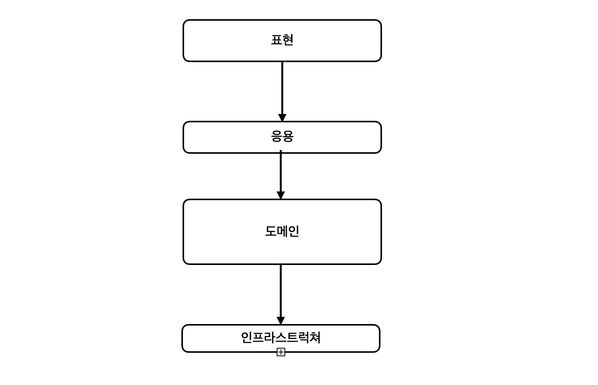
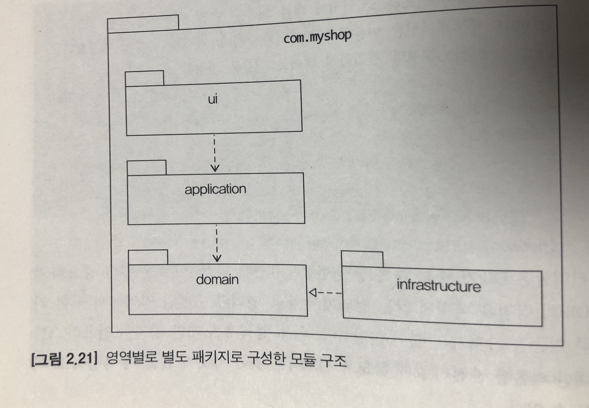
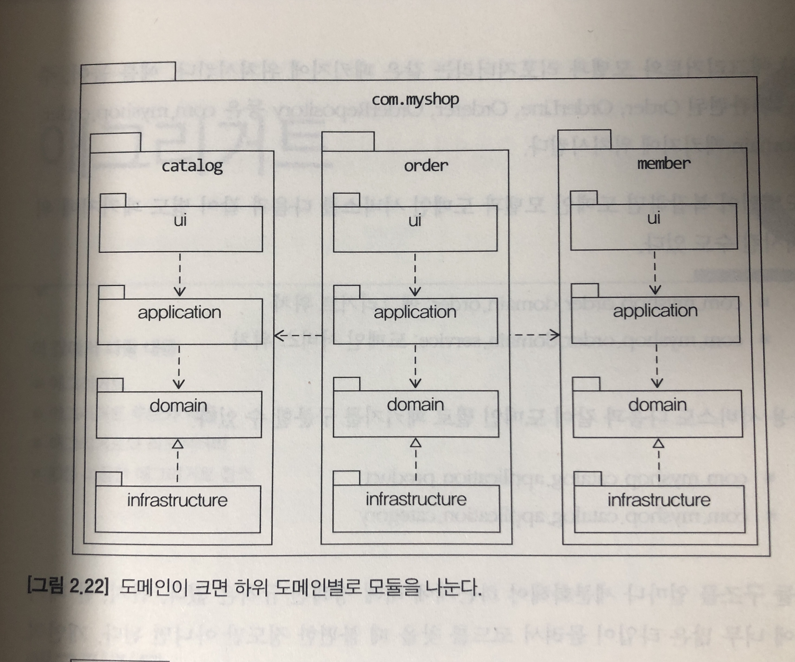
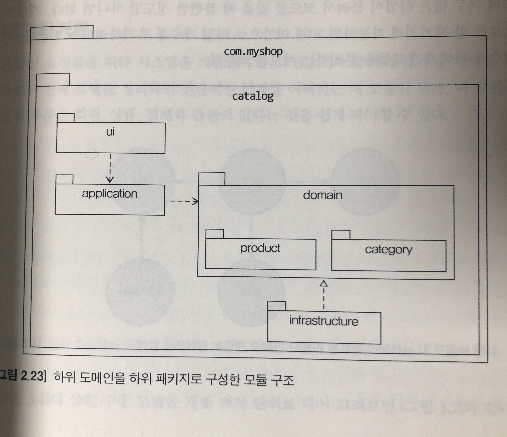

# 1. 도메인 모델 시작

### 도메인

도메인은 여러 하위 도메인으로 구성할 수 있다. 한 하위 도메인은 다른 하위 도메인과 연동하여 완전한 가능을 제공한다. ex) 고객이 물건을 구매하면 주문, 결제, 배송, 혜택 하위 도메인의 기능이 엮인다. 

특정 도메인을 위한 소프트웨어라고 해서 도메인이 제공해야 할 모든 기능을 구현하는 것은 아니다.

### 도메인 모델 패턴

일반적인 아키텍처는 네 개의 계층으로 구성된다

**사용자인터페이스 또는 표현**

- 사용자의 요청을 처리하고 사용자에게 정보를 보여준다.

**응용**

- 사용자가 요청한 기능을 실행한다. 업무 로직을 직접 구현하지 않으며 도메인 계층을 조합해서 기능을 실행시킨다.

**도메인**

- 시스템이 제공할 도메인의 규칙을 구현한다. (도메인의 핵슴 규칙을 구현한다

**인프라스트럭쳐**

- DB나 메시징 시스템과 같은 외부 시스템과의 연동을 처리한다.

### 엔티티 식별자와 밸류 타입

엔티티 식발자의 Stringㄷ 같은 문자열로 구성 될 경우 밸류 타입을 이용해 의미가 잘 드러나도록 하라.

```java
public class Order {
    private String orderNo; // before
	// OrderNo 타입 자체로 id가 주문번호임을 알 수 있다.
	private OrderNo id;     // after    
}
```
</br>

# 2. 아키텍처 개요

## 네 개의 영역

- 표현: HTTP 요청을 응용 영역이 필요하는 형식으로 전달한고, 응용 영역의 응답을 HTTP 응답으로 변환하여 전송한다.
- 응용: 시스템이 사용자에게 제공해야될 기능을 구현한다. ex) "주문 등록", "주문 취소"
- 도메인: 도메인 모델을 구현한다. 도메인 모델은 도메인의 핵심 로직을 구현한다.
- 인프라스트럭처: 구현 기술에 대한 것을 다룬다. ex) DB, 메시징 큐 전송, 수신 ...



응용 계층은 유연하게 외부 시스템과의 연동을 위해 인프라스트럭처에 의존하기도 한다.
</br>
응용, 도메인 계층이 상세한 기술은 인프라스트럭처 계층에 종속되는데, "테스트", "기능 확장"의 문제가 발생한다.
</br>

이 문제는 이는 `DIP`를 이용하여 해결할 수 있다. 고수준 모듈(의미 있는 단일 기능을 제공)의 기능을 구현하려면 여러 하위 기능이 필요하다. 즉 고수준 모듈이 저수준 모듈을 사용해야하는데 `DIP`는 저수준 모듈이 고수준 모듈에 의존하도록 변경한다.
</br>

저수준 모듈에 직접 의존할 때는 헤당 모듈이 직접 만들어지기 전까지는 테스트하기가 힘들지만 인터페이스를 이용하므로 stub을 사용하여 테스트를 진행할 수 있다.

**주의 사항**
</br>
DIP는 인터페이스와 구현 클레스를 분리하는 정도로만 받아들일 수 있는데, 핵심은 고수준 모듈이 저수준 모듈에 의존하지 않도록 하기 위함이다.


### 도메인 영역의 주요 구성요소

|요소|설명|
|---|---|
|Entity| 고유 식별자로 갖는 객체. 도메인 모델의 데이터를 포함하여 해당 데이터와 관련된 로직을 제공한다
|Value| 고유 식별자를 갖지 않는 객체로 주로 개념적으로 하나의 도메인 객체의 속성을 표현하는데 사용|
|Aggreagte| 앤티티와 밸류 객체를 하나로 묶은 것|
|Repository| 도메인 모델의 영속성을 처리한다 |
|Domain Service| 특정 엔티티에 속하지 않은 도메인 로직을 제공. 도메인 로직이 여러 엔티티 밸류가 필요할 경우 도메인 서비스에서 로직을 구현한다|

### 모듈 구성

 </br>

[soruce](https://www.aladin.co.kr/shop/wproduct.aspx?ItemId=84000742)
</br>
영역별 별도 패키지로 구성한 모둘



[soruce](https://www.aladin.co.kr/shop/wproduct.aspx?ItemId=84000742)
</br>
domain 모듈은 도메인에 속한 애그리거트를 기준으로 패키지 재구성.




[soruce](https://www.aladin.co.kr/shop/wproduct.aspx?ItemId=84000742)
</br>
하위 도메인을 하위 패키지로 구성한 모듈 구조

도메인이 너무 복잡해지면 도메인 모델과 도메인 서비스를 나눌 수도 있다
- com.woodcock.order.domain.order: 애그리거트 위치
- com.woodcock.order.domain.service: 도메인 서비스 위치

---

# 3. 애그리거트

애그리거트의 경계는 도메인 규칙과 요구사항에 따라서 설정되며, 한 애그리거트에 속한 객체는 다른 애그리거트에 속하지 않는다. 또한 A가 B를 갖는다고해서 무조건 한 애그리거트로 묶이는 것은 아니다. 대표적으로 상품과 리뷰가 있다. 이 둘은 함께 생성, 변경, 영향을 주지 않는다.

</br>

### 루트 애그리거트
루트 애그리거트란 애그리거트에 속한 모든 객체의 일관된 상태를 유지하도록 관리하는 주체이다. 애그리거트 루트가 제공하는 메소드는 도메인 규칙에 따라 애그리거트에 속한 객체의 일관성이 깨지지 않도록 구현해야 한다. 다른 객체가 애그리거트에 속한 객체를 직접 변경하여 논리적인 데이터의 일관성을 깨뜨리는 일이 없도록 주의해야한다.
</br>

### 트랜잭션 범위

트랜잭션 범위는 가능한 작을 수록 좋다. 동일한 한 트랜잭션에서는 한 개의 애그리거트만 수정해야한다. 두 개 이상의 애그리거트를 수정하면 트랜잭션 충돌이 발생할 가능성이 더 높아지고 애그리거트 개수가 많을 수록 전체 처리량이 떨어진다. 물론 꼭 필요에 의해서 하는 경우는 제외다. 애그리거트가 다른 애그리거트의 기능에 의존하기 시작하면 애그리거트 간 결합도가 높아지고 향후 수정 비용이 증가한다.
</br>
두 개 이상의 애그리거트가 수정되어야 한다면 응요 서비스에서 두 애그리거트를 수정해야한다.

# 4. 리포지터리와 모델 구현

### 밸류 컬렉션: 별도 테이블 매핑

``` java
public class Order {
	private List<OrderLine> orderLines;
	...
}
```

``` java
@Entity
@Table(name = "purchase_order")
public class Order {
	...
	@ElementCollection
	@CollectionTable(name = "order_line", joinColums = @JoinColumm(name = "order_number"))
	@OrderColumn(name = "line_idx")
	private List<OrderLine> orderLines;
	..
}

@Embeddable
public class Or
derLine {
	@Embedded
	private ProductId productId;

	...
}
```
JPA에서는 `@OrderColumn` 애노테이션을 이용해서 지정한 컬럼에 리스트의 인덱스 값을 저장한다. @CollectionTable은 밸류를 저장할 테이블을 지정할 떄 사용한다.

### 밸류 컬렉션: 한 개 컬럼 매핑
별도 테이블이 아닌 한 개의 컬럼에 저장해야할 때. ex) 주소 목록을 Set으로 보관하고 DB에는 한 개 컬럼에 콤마로 구분해서 저장.

``` java
public class EmailSet {
	private Set<Email> emails = new HashSet<>();
	..
}
```

``` java
@Converter
public class EmailSetConverter implements AttributeConverter<EmailSet, String> {
	...
	@Override
	public EmailSet convertToEntityAttribute(String dbData) {
		if (dbData == null) return null;
		String[] emails = dbData.split(",");
		Set<Email> emailSet = Arrays.stream(emails)
			.map(val -> new Email(val))
			.collect(toSet());
		return new EmailSet(emailSet);
	}
	
}
```

``` java
@Column(name = "emails")
@Converter(converter = EmailSetConverter.class)
private EmailSet emailSet;
```

### 별로 테이블에 저장하는 밸류 매핑
애그리거트에서 루트 엔티티를 뺀 나머지 구성요소는 대부분 밸류이다. 루트 애그리거트를 제외한 다른 엔티티가 있다면 진짜 엔티티인지 의심해봐야한다. </br>
별도 테이블에 데이터를 저장한다고 무조건 엔티티가 아니다. 엔티티가 확실하다면 다른 애그리거트인지 확인해봐야한다. 특히 독자적인 라이프사이클을 갖는다면, 다른 애그리거트일 가능성이 높다. </br>

예시로 상세 화면에서 상품 정보와 고객리뷰를 함께 보여주는데, Product와 Review는 함께 생성되지 않고, 함께 변경되지도 않는다. 게다가 변경 주체도 다르다. </br>
상호간에 영향을 주지 않기 때문에 Review는 앤티티는 맞지만 리뷰 에그리거트에 속한 엔티티이지 상품 에그리거트에 속한 엔티티가 아니다.</br>

별도 테이블로 저장되는 PK가 있다고 테이블과 매핑되는 애그리거트 구성요소가 고유 식별자를 갖는 것은 아니다. 밸류를 매핑한 테이블을 지정하기 위해 `@SecondaryTable`과 `@AttributeOverride`를 사용한다. </br>

# 6. 응용 서비스와 표현 영역

### 표현 영역과 응용 영역
표현 영역은 사용자의 요청을 해석한다. 실제 사용자에게 서비스를 제공하는 곳은 응용 영역에 위치한 서비스다. </br>
응용 서비스는 사용자의 요청을 처리하기 위해 리포지터리로부터 도메인 객체를 구하고, 도메인 객체를 사용한다. 표현 영역 입장에서 보면 응용 서비스는 도메인 영역과 표현 영역을 연결해주는 창구인 파사드 역할을 한다. </br>
응용 서비스가 너무 복잡하면 응용 서비스에서 도메인 로직을 일부 구현하고 있을 가능성이 있다. 응용 서비스의 주된 역할 중 하나는 트랜잭션 처리이다.응용 서비스는 도메인 상태 변경을 트랜잭션으로 처리해야 한다. 

### 도메인 로직 넣지 않기
도메인 로직은 도메인 영역에 위치하고 응용 서비스는 도메인 로직을 구현하지 않는다. 도메인 로직을 도메인 영역과 응용 서버스에 분산해서 구현하면 코드 품질에 문제가 생긴다. </br>
첫째. 코드의 `응집성`이 떨어진다. 도메인 로직을 파악하기 위해 여러 영역을 분석해야한다는 것을 의미한다. </br> 
둘 째. 여러 응용 서비스에서 동일한 도메인 로직을 구현할 가능성이 높아진다. 결과적으로 이 둘은 응집도가 떨어지고 코드 중복이 발생하여 변경을 어렵게 만든다.

## 응용 서비스 구현
### 응용 서비스의 크기
ex) 응용 서비스는 회원 가입, 탈퇴, 암호 변경 같은 기능을 구현하기 위해 도메인 모델을 사용하게 된다. 이 경우 보통 응용 서비스는 다음의 두 가지 방법 중 한 가지 방식으로 구현한다.
- 한 응용 서비스 클래스에 회원 도메인의 모든 기능 구현하기
- 구분되는 기능별로 응용 서비스 클래스 따로 구현하기

한 클래스에서 모두 구현한 경우
``` java
public class MemberService {
	public void join(MemberJoinRequest request) {...}
	public void changePwd(...) {...}
	...
}
```
한 도메인과 관련된 기능들이 한 클래스에 있어서 코드 중복을 제거할 수 있다는 장점이 있지만, 서비스 클래스의 크기가 너무 커지게 된다. 즉 책임이 너무 커지게 된다. </br>
이 코드는 점점 얽히게 되고 코드 품질을 낮추는 결과를 초래하게 된다. 구분되는 기능별로 서비스 클래스를 구현하면 한 응용 서비스 클래스에서 1~3개의 기능을 구현한다.

``` java
public class ChangePasswordService {
	public void changePwd(...) {...}
}
```
이 방식은 클래스 개수가 많아지지만 한 클래스에 관련 기능을 모두 구현하는 것과 비교해서 코드 품질을 일정 수준으로 유지하는 데 도움이 된다. </br>
또한 다른 기능을 구현한 코드에 영향을 받지 않는다. 각 기능마다 동일한 로직을 구현할 경우 여러 클래스에서 중복해서 동일한 코드를 구현할 가능성이 있다. 이럴 경우 별도 클래스에 로직을 구현해서 코드가 중복되는 것을 방지할 수 있다.

### 응용 서비스의 인터페이스와 클래스.

인터페이스가 필요한 경우가 몇 가지 있는데, 그 중 하나는 구현 클래스가 여러 개인 경우다. 그런데 응용 서비스는 보통 런타임에 이를 구체하는 경우가 드물다. </br>
이런 이유로 인터페이스와 클래스를 따로 구현하면 소스 파일만 많아지고 복잡해지는 문제가 발생한다. 따라서 인터페이스가 명확하게 필요하기 전까지는 응용 서비스에서는 인터페이스를 작성하는 것이 좋은 설계라고 볼 수는 없다. </br>

### 메서드 파라미터와 값 리턴
응용 서비스는 기능을 수행하는데 필요한 파라미터를 전달 받아야한다. 파라미터는 개별 파라미터로 전달 받을 수 있고, 별도 데이터 클래스로 전달 받을 수 있다.
</br>

``` java 
public class ChangePasswordService {
	public void changePassword(ChangePasswordRequest request) {...}
}
```
응용 서비스에서는 필요한 데이터를 꺼내서 사용하면 된다.

### 표현 영역에 의존하지 않기
응용 서비스의 파라미터 타입을 결정할 때 주의할 점은 표현 영역과 관련된 타입을 사용하면 안 된다. 응용 서비스에 표현 영역에 대한 의존이 발생하면, 응용 서비스만 단독으로 테스트하기 어려워진다. 게다가 표현 영역의 구현이 변경되면 응용 서비스의 구현도 함께 변경해야되는 문제가 생긴다. </br>

표현 영역의 책임은 크게 다음과 같다
- 사용자가 시스템을 사용할 수 있는 흐름을 제공하고 제어한다.
- 사용자의 요청을 알맞은 응용 서비스에 전달하고 결과를 사용자에게 제공한다.
- 사용자의 세션을 관리한다.


## 권한
표현 영역에서 할 수 있는 가장 기본적인 검사는 인증된 사용자인지 아닌지 여부를 검사하는 것이다. 이런 접근 제어를 하기에 좋은 위치가 서블릿 필터이다. 서블릿 필터에서 사용자의 인증 정보를 생성하고 인증 여부를 검사하는 것이다. </br>
인증 여부 뿐만 아니라 권한에 대해서 동일한 방식을 필터로 사용해서 URL별 권한을 검사할 수 있다.


# 8. 애그리거트 트랜잭션 관리

### 애그리거트와 트랜잭션

한 주문 에그리거트에 대해 운영자는 배송으로 상태를 변경 할 때, 사용자가 배송지 주소를 변경하면 어떻게 될까? </br>
메모리 캐시를 사용하지 않을 경우 운영자 스레드와 고객 스레드는 같은 주문 애그리거트를 나타내는 다른 객체를 구하게 된다. </br>
</br>
운영자 스레드와 고객 스레드는 개념적으로 동일한 애그리거트지만, 물리적으로 다른 객체를 사용하므로 운영자 스레드가 주문 애그리거트 객체를 배송 상태로 변경하더라도 고객 스레드가 사용하는 주문 애그리거트 객체에는 영향을 주지 않는다. </br>
고객 스레드 아직 배송 전이므로 배송지 정보를 변경할 수 있다. </br>

이 상황에서 두 스레드는 각각 트랜잭션을 커밋할 때 수정한 내용을 DBMS에 반영한다. 즉 배송 상태로 바뀌고 배송지 정보도 바뀌게 된다. 즉 애그리거트의 일관성이 깨진 것이다. </br>

이 문제를 막기위해서는 두 가지 방법을 고려할 수 있다.
- 운영자가 배송지 정보를 조회하고 변경하는 동안 고객이 애그리거트를 수정하지 못하게 한다.
- 운영자가 배송지 정보를 조회한 이후에 고객이 정보를 변경하면 운영자가 애그리거트를 다시 조회한 뒤 수정하도록 한다.

애그리거트에 사용할 수 있는 대표적인 트랜잭션 처리 방식에는 `Pessimistic Lock`(비관적 락)과 `Optimisitic`(낙관적 락) 방식이 있다. </br>

### 비관적 락

비관적 락은 먼저 애그리거트를 구한 스레드가 애그리거트 사용이 끝날 때까지 다른 스레드가 해당 애그리거트를 수정하는 것을 막는 방식. 이렇게 되면 t1에서 Lock을 걸고 t2는 애그리거트를 구하는 시도를하면 Lock이 해제될 때 까지 블로킹된다.

t1이 애그리거트를 수정하고 트랜잭션을 커밋하면 잠금을 해제한다. 이 때 대기하고있던 t2가 애그리거트에 접근한다. 결과적으로 t1이 배송상태로 변경이 끝난 뒤 t2는 애그리거트를 구하고 Lockd을 건다. 그 후 배송지 변경 시도가 실패하고 트랜잭션이 실패하며 잠금을 해제된다. </br>

선점 잠근은 보통 DMBS가 제공하는 행 단위 잠금을 사용해서 구현한다. for update와 같은 쿼리를 사용해서 특정 레코드에 한 사용자만 접근할 수 있는 잠금 장치를 제공한다. </br>

### 비관적 락, 교착 상태

비관적락을 사용할 때는 잠금 순서에 따른 교착 상태가 발생하지 않도록 주의해야한다. 

1. t1. A 애그리거트에 Lock
2. t2. B 애그리거트에 Lock
3. t1. B 애그리거트에 잠금 시도
4. t2. A 애그리거트에 잠금 시도

t1과 t2는 교착 상태에 빠지게 된다. 이런 문제를 해결하려면 잠금을 구할 때 까지 최대 대기시간을 지정해야한다. </br>

### 낙관적 락

낙관적 락은 잠금을 해서 동시에 접근하는 것을 막는 대신, 변경한 데이터를 실제 DBMS에 반영하는 시점에 변경 가능 여부를 확인한다. </br>
JPA에서는 `@Version`을 이용해서 낙관적 락 기능을 사용할 수 있다. 자동으로 관리할 수 있다. Version이 맞지 않는다면, 트랜잭션이 충돌한 것이므로 트랜잭션 종료 시점에 익셉션이 발생한다.
