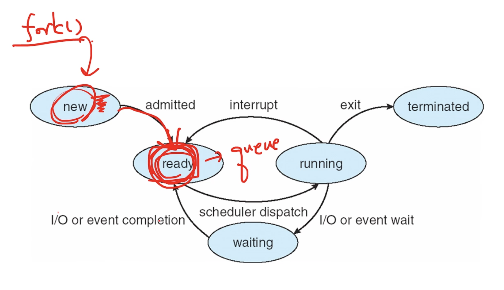
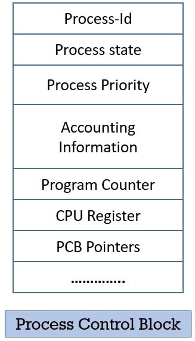
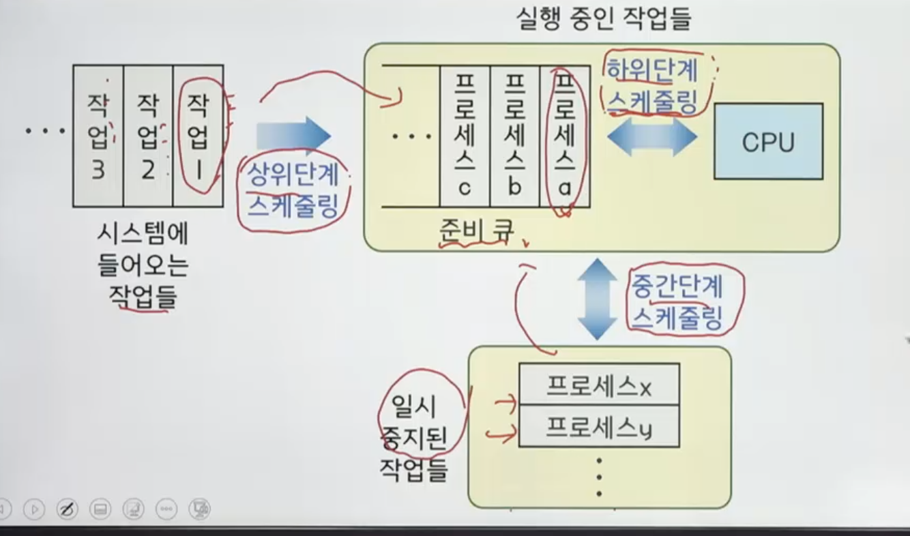
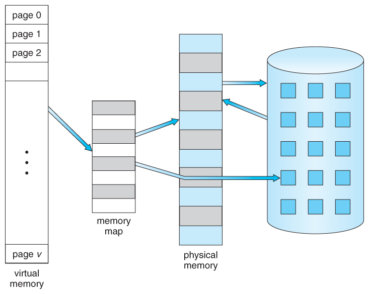

# 운영체제 개요
## 운영체제

컴퓨터의 하드웨어 자원을 관리하고 컴퓨터 프로그램이 동작하기 위해 제공하는 시스템 소프트웨어

사용자 지원

- 사용자의 명령을 해석하여 실행
- 사용자와 하드웨어 사이의 매개체 역할 수행

### CPU의 동작 모드

- 슈퍼 바이저 모드 (커널 모드)
    - 운영체제의 커널이 동작되는 모드
    - 하드웨어를 직접 제어할 수 있는 CPU 명령어 사용 가능
- 보호 모드(사용자 모드)
    - 응용 프로그램이 동작되는 모드
    - 하드웨어로를 직접 제어할 수 있는 CPU 명령어 사용 불가능.

그럼 어떻게  보호에서 슈퍼바이저 모드로 전환?

- system call
    - 응용 프로그램이 운영체제에게 서비스를 요청하는 메커니즘

순서: 시스템 호출 → 보호모드에서 슈퍼바이저 모드로 변경 → 커널 동작 → 하드웨어 제어

### 커널

- 운영체제의 핵심 요소
- 응용 프로그램과 하드웨어 수준의 처리 사이의 가교 역할
- 대표적인 구성 방식: 일체형 커널, 마이크로 커널

일체형 커널 (monolithic kernel)

- 운영체제의 모든 서비스가 커널 내에 포함됨
- 장점
    - 커널 내부 요소들이 서로 효율적으로 상호작용할 수 있음.
- 단점
    - 한 요소에 있는 오류로 인해 시스템 전체 장애 발생할 수 있음
    - 예) UNX, Linux

마이크로 커널

- 운영체제의 대부분의 요소들을 커널 외부로 분리
- 커널 내에는 메모리 관리, 멀티 태스킹, 프로세스 간 통신(IPC) 등 최소한의 요소만 남김
- 장점
    - 새로운 서비스를 추가하여 운영체제 확장 쉬움
    - 유지 보시 용이, 안정성 우수
- 단점
    - 커널 외부 요소들 사이에는 IPC를 통해야만 하므로 성능 저하가 발생

## 운영체제 구성

프로세스 관리자

- 프로세스를 생성, 삭제 , CPU 할등을 위한 스케줄 결정.

메모리 관리자

- 메모리 공간에 대한 요구의 유효성 검사
- 메모리 할당 및 회수, 공간 보호

장치 관리자

- 컴퓨터 시스템의 모든 장치를 관리
- 시스템의 장치를 할당, 작동 시작, 반환

파일 관리자

- 컴퓨터 시스템의 모든 파일을 관리
- 파일의 접근 제한 관리
- 파일을 열어 자원을 할당하거나 파일을 닫아 자원을 회수

## 운영체제의 유형

- 일괄처리 운영체제 (초기)
    - 작업을 모아서 처리
    - 사용자와 상호작용 없이 순차적으로 실행
    - 효율성 평가: 처리량, 반환시간 (시작부터 끝나는 시간)
- 대화형(interactive) 운영체제
    - 시분할 운영체제라고도 함
    - 일괄처리 운영체제보다 빠르지만, 실시간 운영체제보다 느린 응답시간(요청한 시점부터 반응이 시작되는 시점).
    - 이용자에게 즉각적인 피드백을 제공
- 실시간(real-time) 운영체제 (RTOS)
    - 가장 빠른 응답시간
    - 처리의 결과가 현재의 결정에 영향을 주는 환경에서 사용
    - 특수 목적으로 사용: 우주 비행 시스템, 미사일 제어, 증권 거래 관리 시스템, 은행 입출금 시스템 등에 사용
- 하이브리드 운영체제
    - 일괄처리 운영체제와 대화형 운영체제의 결합
    - 이용자는 터미널을 통해 접속하고 빠른 응답시간을 얻음
    - 대화형 작업이 많지 않은 경우 백그라운드에서 배치 프로그램 실행
    - 현재 사용되고 있는 대부분의 대형 컴퓨터 시스템은 하이브리드 운영체제.

---
## 프로세스

운영체제로부터 자원을 할당 받아 동작

- 자원: CPU, 메모리, 입출력장치, 파일 등
- 동작: CPU가 프로세스의 명령을 실행

프로세스 관리자의 역할

- 프로세스를 생성 및 삭제
- 프로세스 실행을 위한 스케줄 결정
- 프로세스의 상태를 관리하며 상태 전이를 처리

상태 
- New: 처음 작업이 시스템에 주어진 상태.
- Ready: 실행 준비가 되어 CPU 할당을 기다리는 상태. (ready → running = dispatch)
- Waiting: 특정 이벤트를 대기하는 프로세스 ex) I/O completion or reception of a signal
- Running: 프로세스가 처리되는 상태
- Terminate: 모든 처리가 완료되어 사용자에게 반환되는 상태

 
soruce: 공룡책

### PCB (Process Control Block)
- 프로세스의 관리를 위한 목적
- 프로세스의 정보를 보관
- 각 프로세스마다 존재
- 프로세스가 진행함에 따라 내용 변경

프로세스 생성 작업

- 프로로세스 이름(번호, PID) 결정
- 준비 큐에 삽입
- 초기 우선순위 부여
- PCB 생성 등
 
프로세스 생성 시스템 콜

- 하나의 프로세스가 프로세스 생성 시스템 콜을 통해 새로운 프로세스를 생성 
(시스템 프로세스와 사용자 프로세스 모두 부모프로세스 가능)
- ex: fork()
- 호출하는 프로세스: 부모 프로세스
- 생성되는 프로세스: 자식 프로세스

생성되는 프로세스의 자원

- 운영체제로부터 직접 얻는 경우
- 부모 프로세스 자원의 일부를 얻는 경우
- 자식 프로세스의 자원은 부모 프로세스의 자원으로 자원으로 제한
  - 과도한 자식 프로세스 생성에 따른 시스템 과부하 방지

프로세스 종료

- 프로세스의 마지막 명령이 실행을 마치는 경우
- 프로세스 종료 시스템 콜 ex) exit()
- 프로세스 종료 후 부모 프로세스에게 실행 결과를 되돌려줌

프로세스 종료 시스템 호출

- 부모에 의해서만 호출
- 자식 프로세스가 할당된 자원의 사용을 초과할 때 혹은 더 이상 필요치 않을 때

## 스레드

프로세스 단점

- 멀티 프로세스에서 context switcing 비용이 비싸다. (프로세스마다 각각의 메모리 갖고있 음)
- IPC를 이용하는 것도 비용이 비쌈
- 
스레드
- 프로세스 내에서의 다중 처리를 위해 제안된 개념
- 하나의 프로세스 내에서는 하나 이상의 스레드가 존재
- 하나의 스레드 내에서는 하나의 실행점만 존재 
- 실행에 필요한 최소한의 정보만 가지며, 자신이 속해 있는 프로세스의 실행 환경을 공유
- stack 

 
[source](https://www.tutorialspoint.com/operating_system/os_multi_threading.htm)

다중 스레드의 장점

- 멀티 cpu 혹은 멀티코어 시스템에서는 병렬처리 가능
- 처리 속도 별로 스레드가 나눠진 경우 효율적인 처리 가능
- 멀티 스레드에서 context switching 비용 저렴
---

## 스케줄링

스케줄링 단계

1. 시스템에 들어오는 작업들을 쌓음. (요구사항만 파악하고 실제로 자원을 할당하지는 않음)
2. 상위단계 스케줄링: 활용 가능한 자원들이 발생할 경우 특정 상이단계 스케쥴링을 통해서 준비큐에 넣어준다. (프로세스 만들어짐 ready 상태) 
3. 하위단계 스케줄링: cpu가 가용해지면 하위단계 스케줄링을 통해 필요한 프로세스에 자원을 할당해준다.
* 너무 많은 프로세스들이 쌓여서 자원이 부족한 경우: 중간단계 스케줄링을 통해 잣미 중지한다. (자원을 내놓음 1단계로 가지는 않음) - 다시 상태가 회복되면 중간단계 스케줄링 통해서 다시 준비큐에 넣음.

장기 스케줄링

- 어떤 프로세스를 준비 큐에 삽입 할지 결정
- 선택 기준: 시스템의 효율적으로 이용할 수 있도록 하는 것.
- 입출력(I/O) 중심 작업과 연산 중심 작업을 균일하게 선택

단기 스케줄링

- 프로세스 중에서 어떤 프로세스를 cpu에 할당할지 결정 (디스패치)

중간단계 스케줄링 (CPU)

- 프로세스를 일시적으로 메모리에서 제거하여 중지시키거나 다시 활성화시킴
- 시스템에 단기적인 부하를 조절

스케줄링 목표

- 공정성: 모든 프로세스가 적정 수준에서 CPU 작업을 할 수 있게함
- 균형: 시스템의 자원들이 충분히 활용될 수 있게 함.

### 스케줄링 정책
 

### **선점 스케줄링 정책**

- 진행 중인 프로세스에 인터럽트를 걸고 다른 프로세스에 CPU를 할당하는 스케줄링 전략
- 높은 우선순위의 프로세스를 긴급하게 처리할 때 유용
- context switching에 따른 오버헤드 발생 (context: cpu의 모든 레지스터와 기타 운영체제에 따라 요구되는 프로세스의 상태)

**SRT (Shortest Remaining Time)**
- SJF 스케줄링을 선점 형태로 수정한 알고리즘
- 실행중인 작업이라도 처리시간이 더 짧은 프로세스가 생기면 해당 프로세스를 dispatch
- SJF보다 평균 대기시간이나, 평균 반환시간에서 효율적

**RR (Round Robin)**
- 준비 큐에 도착한 순서에 따라 dispatch 하지만 정해진 시간 할당량에 의해 실행을 제한
- 시간 할당량 안에 완료되지 못한 프로세스는 준비 큐의 맨 뒤에 배치
- context switching에 따른 오버헤드가 큰 반면 응답시간이 짧아져서 실시간 시스템에 유리

**다단계 피드백 큐 (Multilevel Feedback Queue Scheduling)**
- low-priority 큐에서 너무 오래 대기하는 프로세스는 higher-priority 큐로 이동
- 가장 일반적인 cpu 스케줄링
- I/O 중심 프로세스와 cpu 중심 프로세스의 특성에 따라 서로 다른 할당량 부여
- n개의 단계 (단계 1 ~ 단계 n)
- 각 단계마다 하나씩의 큐가 존재
- 단계가 커질수록 시간 할당량도 커짐

스케줄링 방법
- 신규 프로세스는 단계 1의 큐에서 FIFO 순서에 따라 cpu 점유 (시간 할당량 있음)
- 입출력 같은 이벤트가 발생하면 cpu를 양보하고 대기 상태로 갔다가, 다시 준비상태가 될 때에는 현재와 동일한 단계의 큐에 배치
- 시간 할당량을 다 썼지만, 프로세스가 종료되지 못했다면 다음 단계의 큐로 이동 배치
- 마지막 단계 n에서는 PR 스케줄링 방식으로 동작
- 단계 k 의 큐에 있는 프로세스가 cpu를 할당 받으려면 단계 1부터 단계 k-1까지모든 큐가 비어있어야만함.
---

### **비선점 스케줄링**

- 프로세스가 cpu를 할당 받아 실행되면 I/O 인터럽트를 걸거나 작업을 종료할 때까지 실행상태에 있게 됨
- 모든 프로세스가 공정하게 순서에 따라 실행됨 → 응답시간 예측 가능
- 짧은 프로세스가 긴 프로세스를 기다리게 될 수 있음

**HRN (Highest Response Ration Next)**
- 준비 큐에서 기다리는 프로세스 중 응답 비율이 가장 큰 것을 dispatch
- 응답 비율 = (대기시간 / 예상실행시간) + 1
  - 에상 실행 시간이 짧을 수록, 대기시간이 길수록 응답 비율이 커짐

**FCFS (Fist Come First Served)**
- 준비큐에 도착한 순서에 따른 dispatch
- 간단한 스케줄링
- 짧은 프로세스가 긴 프로세스를 기다리거나 중요한 프로세스가 나중에 실행될 수 있다
- 프로세스들의 도착 순서에 따라 평균 반환 시간 편차가 큼

**SJF (Shortest Job First Scheduling)**
- CPU 점유 시간이 가장 짧다고 예상되는 프로세스를 dispatch
- 프로세스의 요구시간에 대한 정확한 자료를 얻기 어렵다
- 요구시간이 긴 프로세스의 기아 상태가 발생할 수 있음

---

## 프로세스 동기화

### Critical Section
2개 이상의 프로세스가 동시에 액세스 하면 안 되는 공유 자원을 액세스하는 코드 자원

### 임계 영역 문제를 해결하기 위한 요구 조건
- 상호 배제: 한 프로세스가 임계 영역에서 실행중일 떄 다른 어떤 프로세스도 임계 영역에서 실행할 수 없음
- 진행: 임계 영역에서 실행 중인 프로세스가 없고 여러 프로세스가 임계 영역에서 진입하고자 할 때 그 중에서 적절히 한 프로세스를 결정해야 하며 이 결정은 무한정 미룰 수 없음
- 제한된 대기: 한 프로세스가 임계 영역 진앱 요청 후 수락될 떄까지 다른 프로세스가 임계 영역 진입을 허가 받는 횟수는 제한이 있어야한다.

### 동기화 도구

 

### 뮤텍스
- 한 번에 한 개의 프로세스(쓰레드)만 접근 가능하도록 함.
- 임계 영역에 들어가기 위해서는 `lock`이 필요로하다. -> acquire()
- 임계 영역에서 나갈때 lock을 release 해준다. -> release()

### 세마포어 (Semaphores)
- 공유 자원에 n개의 프로세스(스레드)가 접근할 수 있다.
- 소프트웨어상에서 Critical Section 문제를 해결하기 위한 동기화 도구
- 세마포어 S는 정수값을 가지는 변수와 P(wait)와 V(signal)연산자를 이용한다.

**종류**
- Binary Semaphore: 0과 1 값만 사용이 가능하다. (mutext랑 비슷하게 동작한다)
- Counting Semaphore: 여러개의 인스턴스로 자원을 사용할 수 있다.  (resource가 availabe한 개수만큼 초기화한다)

---

## 교착 상태
### 교착 상태의 필요 조건
상호 배제 조건
- 프로세스들이 자원에 대한 배타적 통제권 요구

점유 대기 조건
- 프로세스가 다른 자원을 할당 받아, 다른 프로세스가 점유하고있는 자원을 기다리고 있음

비산점 조건
- 다른 프로세스들에 의해서 해제되지 않음

환형 대기 조건
- 프로세스의 점유 및 점유된 자원의 요구 관계가 환형을 이루며 대기

### 해결 방법
- 방지: 교착상태의 필요조건 중 하나라도 발생할 수 없도록 방지
- 회피: 알고리즘을 이용하여 데드락이 발생하지 않도록한다 ex) 은행원 알고리즘
- 탐지: 자원 할당 그래프를 통해 교착 상태를 탐지함
- 회복: 교착 상태가 제거될 떄까지 프로세스를 하나씩 종료하거나 모두 중지

---

##  메모리 관리

### 다중 프로그래밍 환경

 

### 메모리 분할

 

**고정 분할**
- 메모리의 여러 개의 고정된 크기의 영억으로 분할.
- 문제점: 내부 단편화
-> 프로세스의 크기가 적재된 영역의 크기보다 적어서 분할 영역 내에 남는 메모리가 낭비된다.

**동적 분할**
- 메모리의 분할 경계가 고정되지 않음. 각 프로세스에게 필요한 만큼 할당
- 문제점: 외부 단편화
-> 메모리의 할당과 반환이 반복되면서 작은 크기의 공백이 메모리 공간에 흩어져 생김
  - 해결 방법: 통합 (인접한 공백을 하나로 만듦), 집약 (메모리 내에 모든 공백을 하나로 모음)

### 메모리 보호

여러 프로세스가 동시에 메모리에 상주하므로 프로세스가 다른 할당 영역에 침범하는 것을 막는 것
- 하한 레지스터와 상한 레지스터를 이용하여 침범하지 못하도록한다. (MMU)
  
[memory](../assets/OS/os-6.png)

### 메모리 배치 기법
- 새로 반입된 프로그램이나 데이터를 어디에 배치할지 결정
 
 
최초 적합
- 프로세스가 적재될 수 있는 빈 공간 중에서 가장 먼저 발견된 곳을 할당

후속 적합
- 최초 적합의 변형으로 이전에 탐색이 끝난 그 다음 부분부터 시작

최적 적합
- 필요한 공간을 제공할 수 있는 빈 고간 중에서 가장 작은곳을 선택

최악 적합
- 필요한 공간을 제공할 수 있는 빈 공간 중에서 가장 큰 곳을 선택하여 할당

### Paging

외부 단편화를 해결하기 위한 비연속적 메모리 공간 할당 기법. 가상 메모리를 고정된 크기의 크기의 블록인 페이지로 나누어 관리한다. 외부 단편화 문제는 해결했지만, 내부 단편화 문제가 있다.

### Segmentation

하나의 프로세스에 속한 논리적인 주소를 페이징처럼 고정적 크기가 아니라 서로 다른 크기의 논리적인 단위인 세그먼트로 분할 하는 기법. 외부 단편화 현상이 나타날 수 있다.

--- 

## 가상 메모리
- 메모리 크기보다 더 큰 기억 공간이 필요한 프로세스를 실행할 수 있도록 하는 방법
- 프로세스에 의해 참조되는 주소를 메모리에서 사용하는 주소와 분리
  - 각 프로그램에 실제 메모리 주소가 아닌 가상의 메모리 주소를 주는 방식이다.
- 필요한 일부만 메모리에 적재

 
[source](https://www.cs.uic.edu/~jbell/CourseNotes/OperatingSystems/9_VirtualMemory.html)

 

shared library를 이용하여 여러 프로세스들 사이에 공유될 수 있게 해준다.

### Demand Paging
- 페이지 요구가 있을 때 요구된 페이지를 메모리로 이동
- 즉, 명령어나 데이터가 참조되면 해당 페이지를 메모리에 적재
- 오버헤드 최소화
- 메모리에 옮겨진 페이지를 모두 프로세스에 의해 실제로 참조된 것
- 프로세스 시작 시점에는 프로세스 진행에 따라 연속적으로 페이지 부재 발생 가능 (성능 저하)

### 페이지 기법

모든 페이지 프레임이 사용되고 있을 때 새로 적재되어야 할 페이지를 어느 페이지와 교체할 것인지 결정
- 교체 대상 선택 -> 보조 기억장치에 보관 -> 새로운 페이지를 적재

**FIFO 교체 기법**
- 메모리 내에 가장 오래 있었던 페이지를 교체

단점

-  오래 전에 적재되었지만 반복적으로 사용되는 페이지가 교체될 수 있다.
-  `Belady`이상 현상 발생
   -  프로세스에 더 많은 수의 페이지 프레임을 할당할 경우 오히려 페이지 부재가 더 많이 발생할 수 있는 현상

**LRU (Least Recently Used)**
- 가장 오랫동안 사용되지 않은 페이지를 교체
- 구현: 참조시간 이용 or 리스트 이용
  - 참조시간: 페이지가 참조될 때마다 그때의 시간을 기록 -> 참조시간이 가장 오래된 페이지를 교체

**LFU (Least Frequently Used)**
- 참조 횟수가 가장 적은 페이지를 교체
- 구현: 참조 횟수를 이용
- 막대한 오버헤드
- 가장 최근에 메모리로 옮겨진 페이지가 교체될 가능성이 높다.

