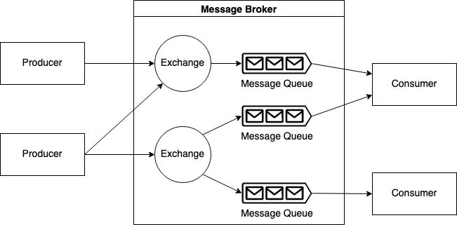
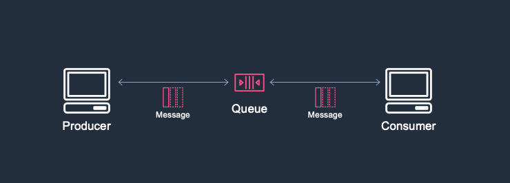

# Message Broker & Message Queue

메시지 브로커란 애플리케이션, 시스템 및 서비스 간에 서로 정보를 공유하고 통신하도록 하는 소프트웨어로 메시지 검증, 라우팅, 보관 등 다양한 기능을 제공한다.

`Message Queue`란 **메시지 지향 미들웨어**(MOM: 응용 소프트웨어 간의 데이터 통신을 위한 소프트 웨어)를 구현한 것이다. 말 그대로 Queue 자료 구조를 활용한 것이다.

[source](https://ademcatamak.medium.com/what-is-message-broker-4f6698c73089)

 

# 메시지 큐를 사용하는 이유?

### **결합도를 낮춘다.**

구성 요쇼간 `결합도`를 낮출 수 있다(종송성 제거). 소프트웨어 구성 요소는 통신 코드의 영향을 받지 않으며, 각자의 비즈니스 로직에 집중할 수 있다.

### **Asynchronous**

Producer가 Consumer에게 메세지를 보내고 응답을 기다리지 않는다. 즉 요청 처리를 할 수 없는 상태여도 메세지를 보내고 다른 일을 할 수 있기 때문에 효율적인 작업 수행이 가능하다.   이러한 방식은 앞서 말한 애플리케이션간 결합을 느슨하게 만들고, `느슨한 결합`은 애플리케이션간 통신을 `간접적`으로 만들어 서로 독립적이게 만들어 장애 복원 등 능력을 향상시킨다..

[source](https://aws.amazon.com/ko/blogs/architecture/introduction-to-messaging-for-modern-cloud-architecture/)

 

### **신뢰성**

전송되는 메세지를 소비할 때 까지 보관 할 수 있고, 전송에 실패하면 다시 큐에 넣는 등 데이터의 `신뢰성`을 높일 수 있다. 

### **확장성**

정확히 필요한 곳을 확장할 수 있다. 워크로드가 피크에 도달하면, 애플리케이의 여러 인스턴스가 충돌 위험 없이 요청을 모두 대기열에 추가할 수 있따. 대기열이 길어질 경우 워크로드를 소비자 플릿 전체로 분산할 수 있다.

 

# 고려 사항

비동기 메세징은 미들웨어 추가로 인해 종단 간 처리 시간에 대기 시간이 지연될 수 있다.
Producer와 Consumer는 미들웨어 의존하기 때문에 장애에 대한 복원을 갖출 수 있도록 확장 되어야한다. 또한 메시지가 손실되지 주의하고 적절한 작업을 보장하기 위해 모니터링 등 관리를 해주어야한다.

 
 

### 학습 참고 문서
- [https://aws.amazon.com/ko/blogs/architecture/introduction-to-messaging-for-modern-cloud-architecture/](https://aws.amazon.com/ko/blogs/architecture/introduction-to-messaging-for-modern-cloud-architecture/)
- [https://www.ibm.com/docs/en/ibm-mq/8.0?topic=overview-introduction-message-queuing](https://www.ibm.com/docs/en/ibm-mq/8.0?topic=overview-introduction-message-queuing)
- [https://ademcatamak.medium.com/what-is-message-broker-4f6698c73089](https://ademcatamak.medium.com/what-is-message-broker-4f6698c73089)