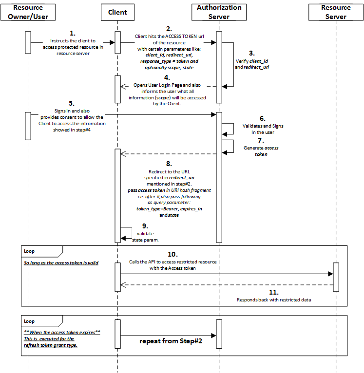

학슴 참고 문서.

[https://developers.google.com/identity/protocols/oauth2](https://developers.google.com/identity/protocols/oauth2)

[https://tools.ietf.org/html/rfc6749#section-1.2](https://tools.ietf.org/html/rfc6749#section-1.2)

[https://d2.naver.com/helloworld/24942](https://d2.naver.com/helloworld/24942)

# OAuth2.0

## OAuth란

사용자가 비밀번호를 노출하지 않고 다른 웹 사이트의 자신의 정보를 웹이나 애플리케이션에 접근 권한을 부여할 수 있는 개방형 표준.

OAuth는 로그인 뿐만 아니라 데이터 접근 권한도 포함하고 있기 때문에, `Authentication` (인증) 뿐만 아니라 `Authorization` (인가) 도 포함하고 있다.

OAuth는 2007년에 최초에 등장했으며 2010년에  OAuth 1.0 프로토콜 표준안이 발표되었다.

## 용어

### **Resource owner**:

User(보호된 자원에 대한 엑세스 권한을 부여할 수 있는 사용자)

### Client: Resource

OAuth를 이용하기 위해 Resource 서버에 등록한 애플리케이션이나 웹 서비스.

### **Resource server**:

허용할 수 있는 보호된 리소스를 호스팅하는 서버, 엑세스 토큰을 사용하여 보호된 리소스 요청에 응답한다.

### **Authorization server**

성공적으로 인증을 마친 클라이언트에게 엑세스 토큰을 발급하는 resource owner.

[공식 표준 문서](https://tools.ietf.org/html/rfc6749#section-1.2)에는 Resource server와 Authorization server를 구분짓지만, 일반적으로 Resource owner하나로 통용하곤 한다.

## OAuth 2.0 flow

### 사전 등록

client가 Resource Server에 사전 등록을 해야한다.

> Client ID - 애플리케이션 식별자</br>Client Secret - 애플리케이션 식별자에 대한 비밀번호  Authorized redirect URIs - 유저가 성공적으로 애플리케이션에 인증을 마친 후, authorization servers는 해당 경로로 리디렉션한다



[reference](https://iteritory.com/tutorial-on-oauth2-implicit-grant-flow/)

```
1: User**가 클라이**언트의 로그인이 필요한 자원에 접근한다.

*2~3: client_id, redirect_url, response_type, scope을 포함하여 사용자의 브라우저를 Authorization Server에 리다이렉션 시킨다. 이때 Authorization Server는 파라미터로 받은 client_id와 **redirect_url**이 사전에 등록된 정보와 일치하는지 검증한다. 민감한 정보가 포함되니 일치하지 않는다면 요청이 거절된다.

4~5: 로그인 페이지를 열고 User에게 Client가 등록한 scope에 대한 정보 제공 동의 허용 여부를 나타낸다. 

6~12: User가 동의하고 로그에 성공하면 Resource Server는 Client에게 "Authorization code"를 발급한다.
그리고 클라이언트는 Authorization code, client id, secret을 Resource Server에 다시 전송한다. Resource Server는 전달받은 데이터를 검증하고 "Access Token"을 Client에게 발급한다.
이제 Access Token을 이용해서 Resource Server에 데이터를 요청하고 검증이 완료되면 Resource서버는 Client에게 scope 범위의 데이터를 응답한다.
```