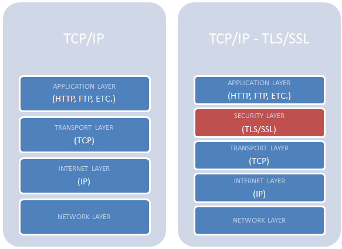
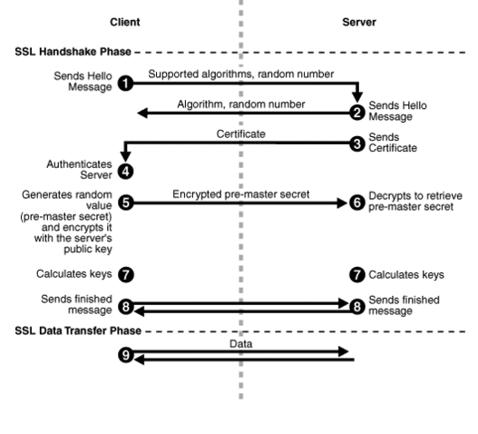

학습 참고 출처
 

- [https://www.red-gate.com/simple-talk/dotnet/net-framework/tlsssl-and-net-framework-4-0/](https://www.red-gate.com/simple-talk/dotnet/net-framework/tlsssl-and-net-framework-4-0/)
- [생활코딩](https://www.youtube.com/watch?v=0cfUVrQW_yg&t=4s)

## HTTPS : HTTP +  S (over Secure Socket Layer)

HTTP의 보안이 강화된 버전이다. HTTPS는 SSL이나 TLS 프로토콜을 통해 세션 데이터를 암호화한다.

HTTPS의 TCP/IP 포트는 443이다.

## SSL 계층 구조

[reference](https://www.red-gate.com/simple-talk/dotnet/net-framework/tlsssl-and-net-framework-4-0/)

Figure 1: Comparing TCP/IP and TCP/IP with TLS/SSL.

`TLS/SSL`은 TCP/IP 레이어 스택에 Security Layer가 추가됨.

이 디자인은 TCP/IP를 기반으로 하는 모든 네트워크 기술과의 완전한 호환성을 보장할 뿐만 아니라, 처음부터 다시 만들지 않고도 보안 버전으로 쉽게 "전환"할 수 있다.

따라서 HTTP는 명세 수정 없이 HTTPS, FTP는 FTPS가 된다.

## SSL(Secure Socket Layer)

- 네트워크로 연결된 컴퓨터간에 인증되고 암호화 된 링크를 설정하기위한 프로토콜

통신중에 데이터를 안전하게 유지하기 위해, TLS/SSL는 암호화 기술을 사용한다.

암호화의 네 가지 목표 (기밀성, 무결성, 인증 및 부인 방지) 중 TLS/SSL는 기밀성, 무결성 및 인증을 보장할 수 있다.

## SSL 디지털 인증서

- SSL 인증서는 클라이언트와 서버간의 통신을 제3자가 보증해주는 전자화 된 문서.
1. 클라이언트가 서버에 접속한 직후에 서버는 클라이언트에게 이 인증서 정보를 전달.
2. 클라이언트 이 인증서 정보가 신뢰할 수 있는 것인지를 검증한 후에 다음 절차를 수행하게 된다.

### SSL의 이점

- 통신 내용이 공격자에게 노출되는 것을 막을 수 있다.
- 클라이언트가 접속하려는 서버가 신뢰할 수 있는 서버인지를 판단할 수 있다.
- 통신 내용의 악의적인 변경을 방지할 수 있다.

### CA

인증서의 역할은 클라이언트가 접속한 서버가 클라이언트가 의도한 서버가 맞는지를 보장하는 역할이다. 이러한 역할을 하는 기업들을 CA(Certificate authority) 혹은 Root Certificate라고 부른다. (브라우저가 선정해서 탑재한다)

### 인증서의 내용

1. 서비스의 정보 (인증서를 발급한 CA, 서비스의 도메인 등) - 클라이언트가 접속한 서버가 의도한 서버가 맞는지에 대한 내용
2. 서버 측 공개키 (공개키의 내용, 공개키의 암호화 방법) - 서버와 통신할 때 사용할 공개키와 그 공개키의 암호화 방법들의 정보

서비스의 도메인, 공개키와 같은 정보는 CA로 부터 인증서를 구입할 때 제출해야함.

위 내용은 CA에 의해서 암호화 된다. 이때 사용하는 암호화 기법은 공개키 방식이다. CA는 자신의 CA 비공개키를 이용하여 서버거 제출한 인증서를 암호화 하는 것이다.

### CA를 브라우저는 알고 있다.

브라우저는 내부적으로 CA리스트를 미리 파악하고 있다. 브라우저의 소스 코드 안에 CA 인증 기관 리스트가 들어있다. 브라우저가 미리 파악하고 있는 CA의 리스트에 포함되어야만 공인된 CA가 될 수 있다. CA의 리스트와 함께 각 CA의 공개키를 브라우저는 미리 알고있습니다.

### SSL 인증서가 서버를 보증하는 방법

1. 웹 브라우저가 서버에 접속할 때 서버는 인증서를 제공한다. 
2. 브라우저는 서버가 제공한 인증서를 발급한 CA가 해당 브라우저가 내장한 CA의 리스트에 있는지를 확인한다. 

확인 결과 서버를 통해서 다운받은 인증서가 내장된 CA 리스트에 포함되어 있다면 브라우저에 내장되어있는 CA의 공개키를 이용해서 해당 인증서를 복호화 한다.

CA의 공개키를 이용해서 인증서를 복호화 할 수 있다는 것은 이 인증서가 CA의 비공개키에 의해서 암호화 된 것을 의미한다. 해당 CA의 비공개 키를 가지고 있는 CA는 해당 CA 밖에는 없기 때문에 서버가 제공한 인증서가 CA에 의해서 발급된 것이라는 것을 의미한다.

CA에 의해서 발급된 인증서라는 것은 접속한 사이트가 CA에 의해서 검토되었다는 것을 의미하게 된다. CA의 검토를 통과했다는 것은 해당 서비스가 신뢰 할 수 있다는 것을 의미한다. 이것이 CA와 브라우저가 특정 서버를 인증하는 과정이다.

### SSL의 동작 방법

SSL은 암호화된 데이터를 전송하기 위해서 공개키와 대칭키를 혼합해서 사용한다. 

즉 클라이언트와 서버가 주고 받는 실제 정보는 대칭키 방식으로 암호화하고, 대칭키 방식으로 암호화된 실제 정보를 복호화할 때사용할 대칭키는 공개키 방식으로 암호화해서 클라이언트와 서버가 주고 받는다. (공개키만 주고받으면 좋지만 컴퓨팅 파워를 많이 쓰게 됨 성능상 안 좋음)

SSL을 쓰면 성능상 이점 + 보안상 이점

- 실제 데이터 : 대칭키
- 대칭키의 키 : 공개키

컴퓨터와 컴퓨터가 네트워크를 이용해서 통신할 때는 내부적으로 3가지 단계가 있다.

- 악수 → 전송 → 세션종료

## handshake

클라이언트와 서버는 실제 데이터를 주고 받기 전에 클라이언트와 서버는 `handshake`를 한다. 이 과정을 통해서 서로 상대방이 존재하는지, 또 상대방과 데이터를 주고 받기 위해서는 어떤 방법을 사용해야하는지를 파악한다.

SSL 방식을 이용해서 통신을 하는 브라우저와 서버 역시 핸드쉐이크를 하는데, 이 때 SSL 인증서를 주고 받는다.

[reference](https://iwillgetthatjobatgoogle.tumblr.com/post/19123958486/https-request-encryption-and-ssl-handshake)

### 과정

1. 클라이언트가 서버에 접속한다. 이 단계를 `Client Hello`라고 한다. 

    이 단계에서 주고 받는 정보.

    - **클라이언트 측**에서 생성한 **랜덤 데이터**
    - 클라이언트가 지원하는 암호화 방식들
    - 세션 아이디 : 이미 SSL 핸드쉐이킹을 했다면 비용과 시간을 절약하기 위해서 [기존의 세션](https://opentutorials.org/course/228/4894#session)을 재활용하게 되는데 이 때 사용할 연결에 대한 식별자를 서버 측으로 전송한다.
2. 서버는 Client Hello에 대한 응답으로 `Server Hello`를 한다. 

    이 단계에서 주고 받는 정보.

    - **서버 측**에서 생성한 **랜덤 데이터**
    - **서버가 선택한 클라이언트의 암호화 방식**
    - **인증서**
3. 클라이언트는 서버의 인증서가 CA에 의해서 발급된 것인지를 확인하기 위해서 클라이언트에 내장된 CA 리스트를 확인한다.
**CA 리스트에 인증서가 없을 경우** 사용자에게 **경고 메시지**를 출력한다. 인증서가 CA에 의해서 발급된 것인지를 확인하기 위해서 클라이언트에 내장된 CA의 공개키를 이용해서 인증서를 복호화한다.

    **복호화에 성공** 했다는 것은 인증서를 전송한 **서버를 믿을 수 있게 된 것**이다.
    클라이언트는 서버의 랜덤 데이터와 클라이언트가 생성한 랜덤 데이터를 조합하여 `pre master secret`라는 키를 생성한다. 

    이 키는 **세션** 단계에서 **데이터를 주고 받을 때** **암호화**하기 위해서 사용될 것이다. 이 **pre master secret 값**을 **서버에 전달**할 때 사용하는 방법이 **공개키** 방식이다.  

    그럼 서버의 공개키는 서버로부터 받은 인증서 안에 들어있다. 이 서버의 공개키를 이용해서 pre master secret 값을 암호화한 후에 서버로 전송하면 안전하게 전송할 수 있다.
    이 때 사용할 암호화 기법은 대칭키이기 때문에 pre master secret 값은 제 3자에게 절대로 노출되어서는 안된다.

    서버의 공개키로 pre master secret 값을 암호화해서 서버로 전송하면 **서버는 자신의 비공개키로 안전하게 복호화 할 수 있다.**

4. 서버는 클라이언트가 전송한 pre master secret 값을 자신의 비공개키로 복호화한다. 그러므로 서버와 클라이언트가 모두 pre master secret 값을 공유하게 된다. 그리고 서버와 클라이언트는 모두 일련의 과정을 거쳐서 pre master secret 값을 `master secret` 값으로 만든다. master secret는 `session key`를 생성하는데 이 session key 값을 이용해서 서버와 클라이언트는 데이터를 대칭키 방식으로 암호화 한 후에 주고 받는다.  세션키 클라이언트와 서버가 모두 공유하게 되었다는 점을 기억하자.
5. 클라이언트와 서버는 핸드쉐이크 단계의 종료를 서로에게 알린다.